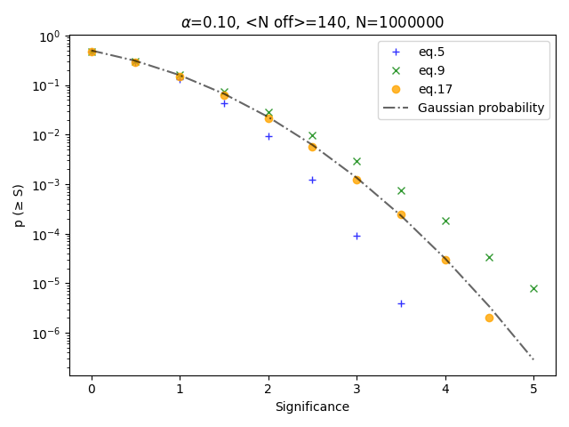
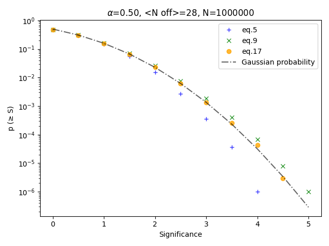
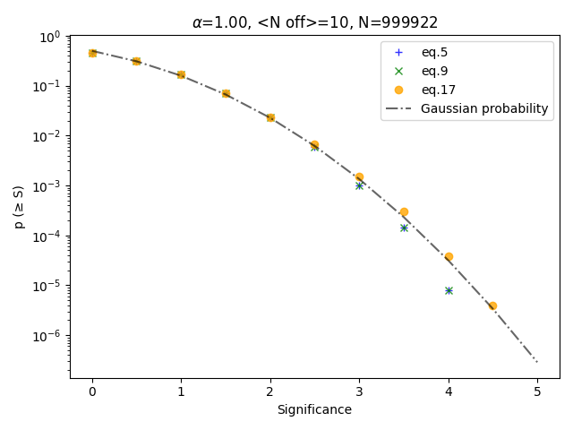
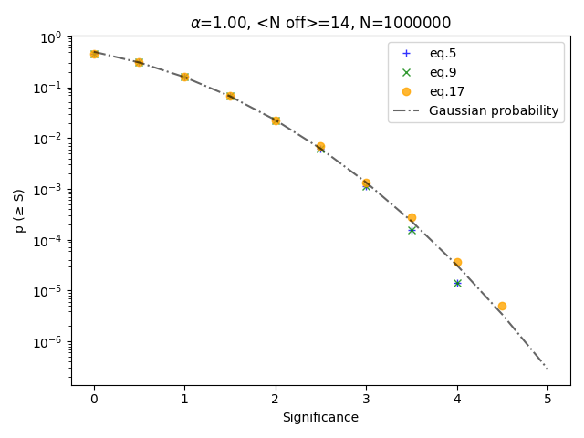
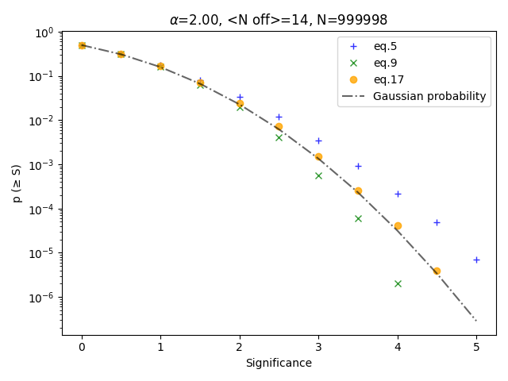
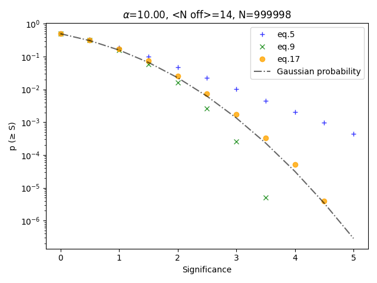

* simulations with ctools
    * crab @ 1800s
    * crab @ 100s
    * crab @ 10s
    * only background
* skymaps for each events list
* extract count on source, off source (on the same skymap), off source from
  empty field
    * circle region (rad 0.25 deg)

* monte carlo simulations
* significances comparison (eq. 5, 9, 17)

