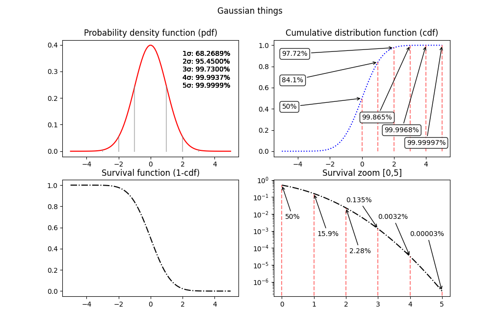
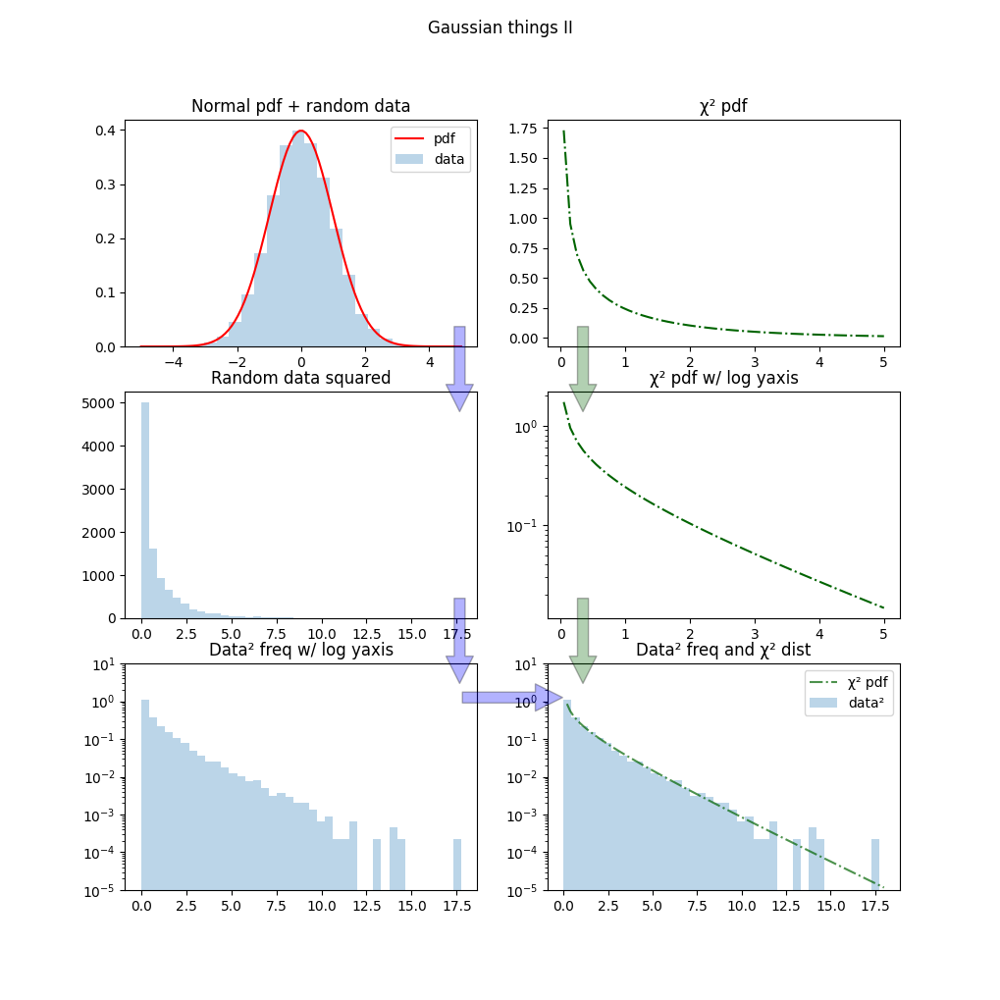
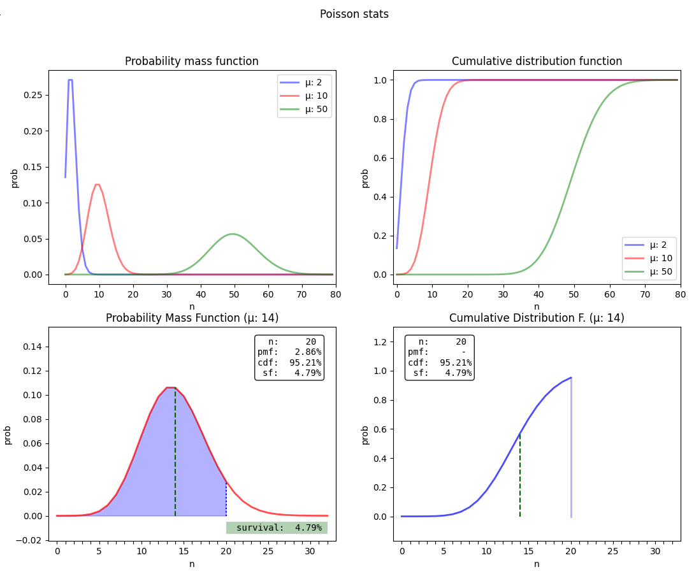

# Statistics things

Playing with statistics.

## Gaussian plots

* playing around with Scipy and normal distribution
* using .plot() to draw vertical lines ending crossing the plot - not .axvline
* a bit as normal ref.

## From normal random data to chi² distribution

* squared normal data go in chi-squared distribution
* using matplotlib FancyArrowPatch

## Poisson plots

* Poisson stats
* animated plots

